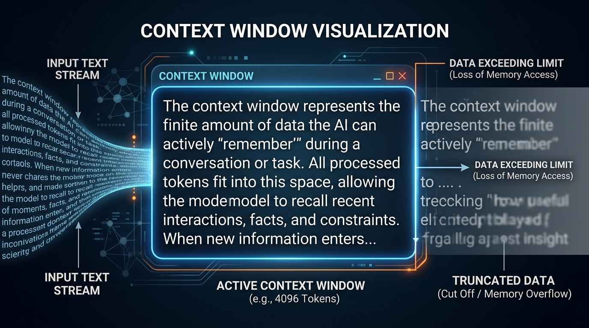
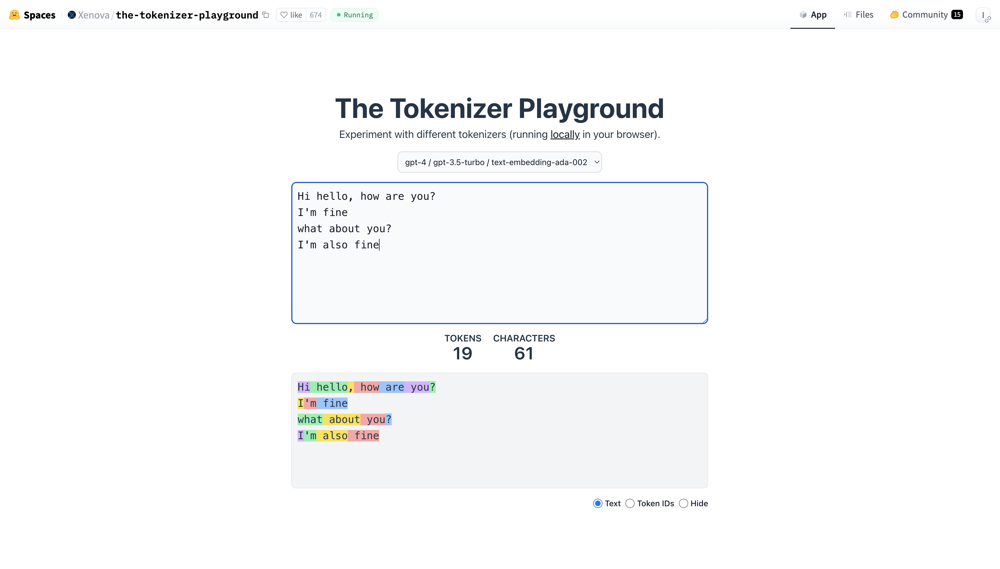
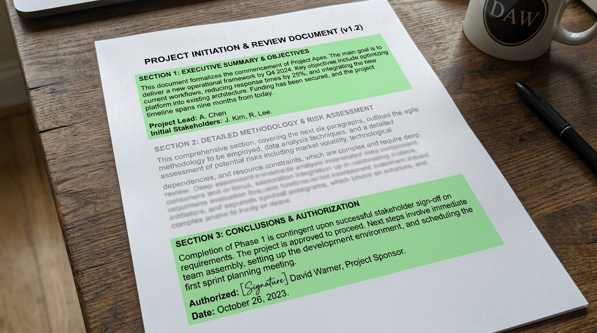
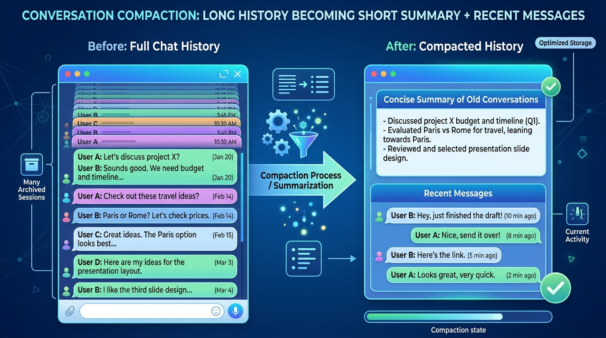
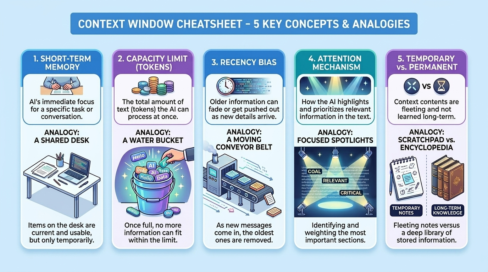

# Context Window Deep Dive: How Your Coding Tools Actually Manage Memory

*A practical guide to understanding why your coding assistant sometimes forgets things, and what you can do about it*



> **In a hurry?** [Jump to the TL;DR](#tldr-just-tell-me-what-i-need-to-know) for the 2-minute version.

---

## Introduction: What Is a Context Window and Why Does It Matter?

Okay, so you're using Cursor or a similar coding tool, and suddenly it starts forgetting what you told it 10 minutes ago. Or worse, it gives you code that completely ignores the file structure you just explained. What's happening here?

Understanding **context windows** is the key to getting better results from your coding tools. It explains why your assistant "forgets" things, why longer conversations get worse over time, and what you can do to fix it.

See, every LLM has what we call a **context window**. Think of it like RAM for the AI's brain - it's basically the total amount of text the model can "see" at any given moment.

**Think of it like a WhatsApp chat screen.** Your phone can only show so many messages at once on the screen. If you scroll up, you can see old messages, but the AI can't scroll - it can only see what fits on one screen. Everything needs to fit in that one screen: your question, the files you shared, the chat history, AND space for the AI to type its reply.

And here's the thing that trips up most developers: this isn't just your prompt. It includes:

- The system prompt (instructions telling the AI how to behave)
- Your entire conversation history
- All the tool outputs (file contents, grep results, terminal output)
- AND the response it's generating

All of this shares the same budget. So when companies advertise "1 million token context!", they're talking about the total space for everything combined. Your input can be at most `contextWindow - maxOutputTokens`.

### How Big Is a Token Anyway?

Roughly speaking, 1 token is about 0.75 words for English text.
But here's the catch: token counts vary by tokenizer. The same sentence might be 10 tokens in one model's tokenizer and 12 in another. Even a single extra space can count as a separate token—every character matters.



**How big is a token really?** Think of it this way:
- One short word like "hello" or "the" = 1 token
- A longer word like "understanding" = 2-3 tokens  
- A typical WhatsApp message ("Hey, are you coming to the meeting today?") = about 10-12 tokens
- One full page of a book (roughly 500 words) = about 650-700 tokens
- A 280-character tweet = about 70 tokens

So when someone says "1 lakh tokens", that's roughly 150 pages of a book, or about 75,000 words. That's a LOT of text - almost a full novel!

Or you can estimate it the way `pi` and `opencode` actually do in their code:

```typescript
// Both repos use this simple heuristic
const CHARS_PER_TOKEN = 4
export const estimate = (input: string) => Math.round(input.length / 4)
```

So 1 million tokens is approximately 750,000 words or about 3 million characters. Sounds massive, right? Well, hold that thought - we'll see why this isn't as simple as it looks.

**Pro tip:** Before shipping production prompts—where every token adds up at scale—test them in the [Tokenizer Playground](https://huggingface.co/spaces/Xenova/the-tokenizer-playground) to optimize costs.


---

## The Current Model Landscape (2026)

Before we get into the actual mechanics, let's see what we're working with. Here's a quick snapshot of context windows across major models:

| Model | Context Window | Max Output | Cost (Input/1M tokens) |
|-------|---------------|------------|------------------------|
| Gemini 2.5 Pro | 2M tokens | 64K | $1.25-$2.50 |
| Llama 4 Scout | 10M tokens | - | Free (open source) |
| GPT-4.1 / GPT-4.1 Mini | 1M tokens | 32K | $2.00 / $0.40 |
| Claude Opus 4.6 | 200K (1M beta) | 64K | $5.00 |
| Claude Sonnet 4.6 | 200K (1M beta) | 64K | $3.00 |
| GPT-5.2 | 400K | 128K | $1.75 |
| DeepSeek V3 | 128K | 8K | $0.14 |

Notice something? The largest context window (Llama 4 Scout at 10M) isn't necessarily the "best" model. Context window size and model quality are actually separate things. Google gives you 2M tokens on both Gemini 2.5 Pro AND Gemini 2.5 Flash - the cheap and expensive versions have the same context.

### What Coding Agents Actually Use

When you're using Cursor, pi, or OpenCode, the model's `contextWindow` property is what matters.

---

## The "Lost in the Middle" Problem



Here's where it gets interesting. Just because a model CAN process 1 million tokens doesn't mean it SHOULD.

Research has shown that models struggle with information buried in the middle of long prompts. This is called the **"lost in the middle"** effect. The model pays more attention to:
1. The beginning of the context (system prompt, first messages)
2. The end of the context (recent conversation)

And stuff in the middle? It gets... fuzzy.

**It's like a long boring college lecture.** Remember sitting in a 3-hour class? You probably remember what the professor said at the start (the intro) and the end (the summary before exam tips). But that stuff in the middle? Fuzzy at best. AI models have the same problem - they pay attention to the beginning and end, but zone out in the middle.

RULER benchmarks show that most models start degrading in quality around 32K tokens - way before they hit their advertised limits ([Hsieh et al., 2024](https://arxiv.org/abs/2404.06654)). So when someone says "my model has 1M context", what they really mean is "my model can technically process 1M tokens but will probably give worse answers after 32K."

This is exactly why coding agents like pi and OpenCode don't just dump your entire codebase into the context. Instead, they use something much smarter: **compaction**.

---

## How Compaction Actually Works



Alright, this is the good stuff. Compaction is basically how coding agents keep your conversation going even when you've been chatting for hours and have burned through way more tokens than the context window allows.

The basic idea is simple: when you're running out of space, summarize the old stuff and keep the recent stuff intact.

**Think of it like packing for a trip.** You have a small cabin bag (the context window). You've been shopping all week and have way more stuff than fits. So what do you do? You keep the important things (passport, laptop, phone charger) and for the rest, you make a list: "bought 3 shirts, 2 pants, gifts for family." The list takes less space than the actual items, but you still remember what you have.

That's compaction - keeping recent important stuff intact, and turning old detailed conversations into a short summary note.

But the implementation? That's where it gets interesting.

### When Does Compaction Trigger?

Both pi and opencode use a similar trigger condition. Here's how pi does it:

```typescript
// From pi/packages/coding-agent/src/core/compaction/compaction.ts (lines 219-222)
export function shouldCompact(contextTokens: number, contextWindow: number, settings: CompactionSettings): boolean {
  if (!settings.enabled) return false;
  return contextTokens > contextWindow - settings.reserveTokens;
}
```

See what's happening? It's not waiting until you hit the limit. It triggers when:

```
contextTokens > contextWindow - reserveTokens
```

This `reserveTokens` is basically headroom for the model's response. You don't want to fill up 100% of the context and leave no room for the AI to actually reply!

The default settings in pi are:

```typescript
export const DEFAULT_COMPACTION_SETTINGS: CompactionSettings = {
  enabled: true,
  reserveTokens: 16384,    // ~16K tokens reserved for response
  keepRecentTokens: 20000, // Keep ~20K tokens of recent conversation
};
```

OpenCode has slightly different defaults:

```typescript
// From opencode/packages/core/src/session/compaction.ts
const DEFAULT_BUFFER = 20_000      // Reserve 20K for response
const DEFAULT_KEEP_TOKENS = 8_000  // Keep 8K of recent conversation
const TOOL_OUTPUT_MAX_CHARS = 2_000
const SUMMARY_OUTPUT_TOKENS = 4_096
```

### The Compaction Flow

Here's what actually happens when compaction triggers:

```
Before compaction:
  [header][usr][ass][tool][usr][ass][tool][tool][ass][tool]
           └─────summarize─────┘ └──────keep──────────────┘

After compaction (what LLM sees):
  [system][summary][usr][ass][tool][tool][ass][tool]
```

Let me break this down step by step:

1. **Find the cut point** - Walk backwards from the newest message, counting tokens until you've accumulated `keepRecentTokens`. Everything before that cut point gets summarized.

2. **Extract messages to summarize** - Grab all the messages from the start (or previous compaction) up to the cut point.

3. **Generate a structured summary** - Call the LLM with a specific prompt to create a summary. Both repos use a similar template:

```markdown
## Goal
- [single-sentence task summary]

## Constraints & Preferences
- [user constraints, preferences, specs, or "(none)"]

## Progress
### Done
- [completed work or "(none)"]
### In Progress  
- [current work or "(none)"]
### Blocked
- [blockers or "(none)"]

## Key Decisions
- [decision and why, or "(none)"]

## Next Steps
- [ordered next actions or "(none)"]

## Critical Context
- [important technical facts, errors, open questions, or "(none)"]

## Relevant Files
- [file or directory path: why it matters, or "(none)"]
```

4. **Append the compaction entry** - Save the summary so it can be loaded next time.

5. **Reload the session** - Now the LLM sees: `[system prompt] + [summary] + [recent messages]`

### Cut Point Rules (The Tricky Part)

You can't just cut anywhere. Here are the rules from pi:

- **Valid cut points**: user messages, assistant messages, bashExecution, custom messages
- **NEVER cut at `toolResult`** - Tool results must stay with their tool call. If you cut between a tool call and its result, the AI gets confused.

```typescript
// From pi - findValidCutPoints() walks entries and only returns valid positions
function findValidCutPoints(entries: SessionEntry[], startIndex: number, endIndex: number): number[] {
  const cutPoints: number[] = [];
  for (let i = startIndex; i < endIndex; i++) {
    const entry = entries[i];
    if (entry.type === "message") {
      const role = entry.message.role;
      // Never cut at toolResult!
      if (role === "user" || role === "assistant" || role === "bashExecution") {
        cutPoints.push(i);
      }
    }
  }
  return cutPoints;
}
```

### Iterative Compaction

Here's something clever - if you've already done compaction before, the new compaction doesn't start from scratch. It uses the previous summary as context:

```typescript
// If previous compaction exists, uses UPDATE_SUMMARIZATION_PROMPT
let basePrompt = previousSummary ? UPDATE_SUMMARIZATION_PROMPT : SUMMARIZATION_PROMPT;

// The update prompt tells the LLM to merge new info into existing summary
const UPDATE_SUMMARIZATION_PROMPT = `Update the existing structured summary with new information.
RULES:
- PRESERVE all existing information from the previous summary
- ADD new progress, decisions, and context from the new messages
- UPDATE the Progress section: move items from "In Progress" to "Done" when completed
...`
```

This way, your summary accumulates knowledge across multiple compaction cycles instead of losing context each time.

### Overflow Detection (The Reactive Approach)

Sometimes you hit the context limit before proactive compaction kicks in. OpenCode handles this with pattern matching against provider error messages:

```typescript
// From opencode/packages/llm/src/provider-error.ts
const patterns = [
  /prompt is too long/i,
  /input is too long for requested model/i,
  /exceeds the context window/i,
  /maximum context length/i,
  /model_context_window_exceeded/i,
  // ... 20+ patterns for different providers
]

export const isContextOverflow = (message: string) =>
  patterns.some((pattern) => pattern.test(message))
```

When this happens, the agent compacts and retries once. Pretty neat fallback.

### Tool Output Pruning

There's another trick opencode uses - pruning old tool outputs even before full compaction:

```typescript
export const PRUNE_MINIMUM = 20_000   // Start pruning after 20K tokens of tool output
export const PRUNE_PROTECT = 40_000   // But protect the last 40K tokens
const PRUNE_PROTECTED_TOOLS = ["skill"]  // Some tools are never pruned
```

This is lighter than full compaction - it just clears the content of old tool results while keeping the structure. So the AI knows "a file was read here" but doesn't have the actual content anymore.

---

## Handling Massive Single Turns (Split Turns)

Okay, here's a tricky edge case that pi handles really well. What if a SINGLE turn is bigger than `keepRecentTokens`?

Normally, compaction keeps entire turns intact. But if one turn has like 50K tokens of tool output (maybe you read a huge file), you can't keep it all.

Pi detects this:

```typescript
// Cut point lands mid-turn at assistant message
const isUserMessage = cutEntry.type === "message" && cutEntry.message.role === "user";
const turnStartIndex = isUserMessage ? -1 : findTurnStartIndex(entries, cutIndex, startIndex);

return {
  firstKeptEntryIndex: cutIndex,
  turnStartIndex,
  isSplitTurn: !isUserMessage && turnStartIndex !== -1,
};
```

When this happens, pi generates TWO summaries in parallel:

```typescript
if (isSplitTurn && turnPrefixMessages.length > 0) {
  // Generate BOTH summaries in parallel
  const [historyResult, turnPrefixResult] = await Promise.all([
    messagesToSummarize.length > 0
      ? generateSummary(messagesToSummarize, model, ...)
      : Promise.resolve("No prior history."),
    generateTurnPrefixSummary(turnPrefixMessages, model, ...),
  ]);
  
  // Merge into single summary
  summary = `${historyResult}\n\n---\n\n**Turn Context (split turn):**\n\n${turnPrefixResult}`;
}
```

The turn prefix gets its own special summary prompt:

```typescript
const TURN_PREFIX_SUMMARIZATION_PROMPT = `This is the PREFIX of a turn that was too large to keep.

Summarize the prefix to provide context for the retained suffix:

## Original Request
[What did the user ask for in this turn?]

## Early Progress
- [Key decisions and work done in the prefix]

## Context for Suffix
- [Information needed to understand the retained recent work]
`
```

This way, even if a turn gets split, the AI still knows what was happening at the start.

---

## Context Epochs: OpenCode's Advanced System Context Management

Now here's something unique to OpenCode that's worth understanding. They have this concept called **Context Epochs** that separates system-level context from chat history.

### What's a Context Epoch?

Think of it this way - your conversation has two types of context:

1. **System Context** - Environment info, date, project instructions (AGENTS.md), working directory
2. **Session History** - Your actual conversation with the AI

OpenCode V2 treats these differently. The system context is immutable during a "Context Epoch" - it doesn't change mid-conversation unless something significant happens.

Here are the key concepts from OpenCode's CONTEXT.md:

| Term | What It Means |
|------|---------------|
| **Context Source** | A single piece of system info (like current date, or working directory) |
| **Context Epoch** | The period where system context stays frozen |
| **Baseline System Context** | The full system context rendered at the start of an epoch |
| **Mid-Conversation System Message** | How the AI learns about context changes |
| **Safe Provider-Turn Boundary** | The only point where context changes can be admitted |

### Built-in Context Sources

Here's what OpenCode automatically includes in system context:

```typescript
// From opencode/packages/core/src/system-context/builtins.ts
const environment = [
  "<env>",
  ` Working directory: ${location.directory}`,
  ` Workspace root folder: ${location.project.directory}`,
  // ... more environment details
  "</env>",
].join("\n")

// Date context with baseline renderer
baseline: (date) => `Today's date: ${date}`,
```

These are rendered once at the start of a Context Epoch and stay frozen until:
- Compaction happens (starts a new epoch)
- You switch models/providers (starts a new epoch)
- Something explicitly triggers a refresh

### Why Does This Matter?

The key insight is: **compaction starts a NEW Context Epoch with a fresh baseline**.

This means after compaction:
- System context is re-rendered from scratch
- Previous "Mid-Conversation System Messages" become audit history only
- The LLM sees a clean slate for system info

Here's how history loading works after compaction:

```typescript
// From opencode/packages/core/src/session/history.ts
// Loads only messages AFTER the latest compaction
const latestCompaction = yield* db.select().from(SessionMessageTable)
  .where(and(eq(...session_id), eq(...type, "compaction")))
  .orderBy(desc(...seq)).limit(1).get()
```

### The Practical Impact

For you as a developer, this means:
- Don't worry about stale environment info after long sessions - compaction refreshes it
- If you switch models mid-conversation, system context gets re-rendered
- Project instructions (AGENTS.md) are re-read at epoch boundaries

This is actually quite clever. Instead of constantly updating system context (which would burn tokens on "context changed" messages), OpenCode waits for natural boundaries like compaction to do a full refresh.

---

## RAG in Coding Agents: The 2026 Reality

Okay, here's something that might surprise you. When I dug through both the pi and opencode codebases looking for RAG (Retrieval Augmented Generation) implementation, you know what I found?

**Nothing.**

No vector databases. No embeddings. No semantic search over your codebase. Both repos confirmed this:

> "Pi does not implement RAG. Searches for `embedding`, `vector`, `retrieval`, and `RAG` found no semantic search or vector store."

> "There is no vector/embedding-based RAG pipeline in OpenCode. No vector DB, no embedding index for session context."

So wait, how do these coding agents find relevant code in your project? The answer is actually much simpler and arguably better for code.

### Tool-Based Retrieval: How It Actually Works

Instead of embedding your entire codebase and doing similarity search, coding agents use **tools**. The AI decides what to search for, runs tools like grep/read/glob, and gets exact results.

Here's what pi uses for context assembly:

| Source | Mechanism | What It Does |
|--------|-----------|--------------|
| System prompt | Static + project files | Base instructions |
| Project instructions | `AGENTS.md` / `CLAUDE.md` walked up ancestor dirs | Project-specific rules |
| Skills | Injected into system prompt | Domain knowledge |
| Tool reads | Agent reads files on demand | Just-in-time context |
| Session history | JSONL tree + compaction summaries | Conversation memory |

OpenCode's approach:

| Tool | Purpose |
|------|---------|
| `grep` / `glob` / `read` | Codebase search & file reads |
| `websearch` / `webfetch` | Web discovery |
| Skills | Load SKILL.md on demand |
| MCP servers | External tool/data sources |

### Why Tool-Based > Vector Search for Code

Here's the thing - code isn't like documents. When you search for "how does authentication work", you don't want the 10 most "semantically similar" code chunks. You want:

1. The actual auth middleware file
2. The config where auth is set up
3. The tests that verify auth behavior

Grep and exact file reads give you this. Vector search gives you... vibes.

OpenCode even has truncation guidance that tells the model to delegate large reads:

```typescript
// From opencode tool/truncate.ts
? `...Use the Task tool to have explore agent process this file with Grep and Read. 
   Do NOT read the full file yourself - delegate to save context.`
: `...Use Grep to search the full content or Read with offset/limit...`
```

### Agentic RAG: The 2026 Pattern

That said, the RAG paradigm has evolved. The old 2024 pattern was:

```
embed -> retrieve -> stuff into prompt
```

The new agentic pattern is:

1. **Decompose** - Break the query into sub-questions
2. **Plan** - Decide which retrieval tools to use
3. **Execute** - Run retrieval iteratively
4. **Evaluate** - Check if results are sufficient
5. **Self-correct** - Generate new queries if needed
6. **Synthesize** - Combine with verified citations

This is exactly what coding agents do! They don't blindly search - they think about what to search, run the search, evaluate results, and search again if needed.

### When Would You Actually Want Vector RAG?

Vector search still makes sense for:
- **Documentation search** - Finding relevant docs by meaning
- **Issue/ticket search** - "Find issues similar to this bug report"
- **Cross-repo discovery** - Finding patterns across many repositories

But for navigating your current codebase? grep + read + glob is faster, more accurate, and doesn't require maintaining an embedding index.

The key quote from my research:

> "A production-ready code agent should be closer to a junior developer with a terminal, editor, search tools, test runner - not a chatbot with a vector database attached."

---

## Practical Tips: Configuring Your Coding Agent

Alright, enough theory. Here's what you should actually do to get the most out of your context window.

### 1. Don't Blindly Trust the "1M Context" Marketing

Just because a model advertises 1 million tokens doesn't mean you should use all of it. Performance degrades well before you hit the limit. The sweet spot is usually around 32K-64K tokens for most use cases.

### 2. Configure Compaction Settings

Both pi and opencode let you tune compaction. Here are the configs:

**For pi** (in `~/.pi/agent/settings.json` or `<project>/.pi/settings.json`):

```json
{
  "compaction": {
    "enabled": true,
    "reserveTokens": 16384,
    "keepRecentTokens": 20000
  }
}
```

**For opencode** (in `opencode.json`):

```json
{
  "compaction": {
    "auto": true,
    "prune": true,
    "buffer": 20000,
    "keep": { "tokens": 8000 }
  }
}
```

What do these mean?
- **reserveTokens / buffer** - Headroom for the model's response. Don't set this too low or responses get cut off.
- **keepRecentTokens / keep.tokens** - How much recent conversation to keep verbatim. Higher = more context preserved, but slower compaction.
- **prune** (opencode only) - Clear old tool outputs without full compaction. Lighter weight.

### 3. Use Manual Compaction When Needed

Both tools support manual compaction:
- **pi**: Type `/compact` in the chat, optionally with instructions like `/compact focus on the auth implementation`
- **opencode**: Use `/compact` or `/summarize`

This is useful when you're about to start a new task and want a clean slate with good context.

### 4. Write Progress to Files

Here's a pro tip from Anthropic's own recommendations: don't rely entirely on context for state. Write important state to files.

```bash
# Good practices:
git commit -m "Implemented auth middleware"  # Commits as checkpoints
echo "## Current Progress\n- Auth done\n- Need to add tests" > PROGRESS.md
```

After compaction, the agent can use `git log` and `git diff` to reconstruct what happened. The summary preserves high-level context, and files preserve details.

### 5. Understand Session Storage

**pi** stores sessions as append-only JSONL trees:
```
~/.pi/agent/sessions/<cwd-encoded>/
```

Each entry has an `id` and `parentId`, forming a tree. You can navigate branches with `/tree`.

**opencode** uses SQLite via Drizzle. Compaction never deletes history - it just changes what the model sees. The full transcript is always recoverable.

### 6. Monitor Context Usage

Both tools show context usage in their UI. In pi, you can see tokens used vs available. If you're consistently hitting compaction, consider:
- Breaking tasks into smaller sessions
- Being more selective about which files you read
- Using grep to search instead of reading entire files

### 7. The Four Pillars of Context Engineering

Anthropic describes these as the fundamentals:

1. **Write** - Craft context pieces specifically for each task
2. **Select** - Pick only the most relevant info from memory/docs/tool outputs
3. **Compress** - Summarize/condense to fit (that's compaction!)
4. **Isolate** - Use subagents with their own context windows for parallel work

The subagent pattern is particularly powerful. Instead of one agent with a bloated context, spawn focused subagents that report back summaries.

---

## Session Storage Deep Dive

Let me quickly explain how your conversations are actually stored.

### pi: Append-Only JSONL Trees

pi uses a tree structure for sessions. Each message is an entry with:

| Entry Type | Purpose |
|------------|---------|
| `message` | User/assistant/toolResult messages |
| `compaction` | Summary + `firstKeptEntryId` pointer |
| `branch_summary` | Summary when navigating tree branches |
| `custom_message` | Extension-injected context |
| `model_change` | Settings metadata |

When building LLM context, pi walks the tree:

```typescript
// buildSessionContext() reconstructs active path
if (compaction) {
  messages.push(createCompactionSummaryMessage(compaction.summary, ...));
  // Emit kept messages (from firstKeptEntryId onward)
  // Emit messages after compaction
}
```

### opencode: SQLite with Message Filtering

opencode stores everything in SQLite but filters what the model sees:

```typescript
// From opencode message-v2.ts
export function filterCompacted(msgs: Iterable<WithParts>) {
  // Reorders messages so model sees:
  // [compaction-user, summary-assistant, retained-tail..., current-turn]
  if (tailIndex >= 0 && tailIndex < compactionIndex && summaryIndex > compactionIndex) {
    return [
      ...result.slice(compactionIndex, summaryIndex + 1),
      ...result.slice(tailIndex, compactionIndex),
      ...result.slice(summaryIndex + 1),
    ]
  }
  return result
}
```

The key insight: **compaction never deletes history - it changes the model-visible representation**. Your full conversation is always there for debugging or recovery.

---

---

## Part 2: Beyond the Basics - Cost, Memory, and Common Misconceptions

Alright, now that we've covered the basics, let's get into some deeper questions that developers often ask but rarely get straight answers to.

---

## How Does "Auto Mode" Actually Pick Which Model to Use?

When you're using Cursor or similar tools, something clever is happening behind the scenes - the system is picking different models for different tasks.

### It's Not One Model Doing Everything

**It's like a restaurant kitchen.** When you order food at a restaurant, the head chef doesn't make everything personally. Simple orders (chai, maggi) go to junior cooks. Complex orders (biryani, special thali) go to senior chefs. The kitchen manager decides who handles what based on difficulty and how busy everyone is.

Cursor's agent is like that kitchen manager - it doesn't just throw everything at one model and hope for the best. It picks the right model for each job - cheap and fast for simple stuff, powerful for complex reasoning.

From Cursor's [Best Practices blog](https://cursor.com/blog/agent-best-practices):

> "When you use Agent, Cursor orchestrates tools specifically for every frontier model based on internal evals and external benchmarks."

In simple terms: the system knows that Claude likes certain tools, GPT prefers others. It adjusts automatically so you don't have to fiddle with prompts.

### Helper Agents (Subagents) Have Their Own Memory

Here's something cool - when you ask something complex like "understand how auth works in this codebase", Cursor might create a separate helper agent just for that task:

| Helper Type | What It Does | Why Separate? |
|-------------|--------------|---------------|
| Research helper | Explores files, searches code | Keeps main chat clean |
| Shell helper | Runs commands, tests | Doesn't clutter your conversation |
| Browser helper | Fetches web info | Isolated from your code context |

Each helper has its **own context window**. So if the research helper reads 50 files, that doesn't eat into YOUR conversation's token budget. Smart, right?

### The Flow Looks Like This

```
Your Request
     │
     ▼
┌─────────────────┐
│  Main Agent     │ ← The brain
├─────────────────┤
│ - Picks models  │
│ - Routes tasks  │
│ - Manages budget│
│ - Creates helpers│
└────────┬────────┘
         │
    ┌────┴────┐
    ▼         ▼
┌───────┐ ┌───────┐
│Cheap  │ │Smart  │
│Model  │ │Model  │
│(quick)│ │(deep) │
└───────┘ └───────┘
```

So when you notice that some responses are faster and simpler while others take longer but are more thoughtful - that's not random. The agent is being smart about resources.

---

## Agent's Context vs Model's Context: They're NOT the Same Thing

Here's a question I get a lot: "My model has 1M token context and my agent manages 100K tokens of history. So I have 1.1M total, right?"

**Nope.** That's like saying "my car has a 50-litre tank and my jerry can holds 10 litres, so I can carry 60 litres in the tank." The jerry can doesn't expand the tank!

### Let Me Explain Simply

| What | What It Means | Who's In Charge |
|------|---------------|-----------------|
| **Model's Context Window** | The fixed limit of how much text the AI can see at once | The company that made the model (OpenAI, Anthropic, etc.) |
| **Agent's Context** | The stuff the agent decides to show the AI | Your tool (Cursor, pi, opencode) |

DeepSeek-V3 can see 128K tokens at a time. That's fixed - you can't change it. What the agent does is **decide what to put** in those 128K tokens.

### Think of It Like a Dabba (Lunchbox)

```
Model's Context Window = 128K tokens (THE DABBA)
                        ┌─────────────────────────────┐
                        │  Instructions     (2K)      │
                        │  Summary of old   (4K)      │
                        │  Recent chat      (20K)     │
                        │  File contents    (30K)     │
                        │  Your question    (2K)      │
                        │  ─────────────────────      │
                        │  Space for reply  (70K)     │
                        └─────────────────────────────┘
                        
Agent's Full History = 500K tokens (STORED IN FILES)
  └── But only ~58K actually sent to the model
```

The agent has 500K tokens of your conversation saved. But it only sends 58K to the model because that's what fits in the dabba!

From the [Context Engineering 2026 Guide](https://tutorials.technology/tutorials/context-engineering-ai-agents-2026.html):

> "Context management should be handled by the orchestration layer (your Python code) before each LLM call."

Translation: The agent is the cook who decides what goes in the dabba. The model just eats what it's given.

**Another way to think about it:** The agent is like your mom packing your tiffin. She has the entire fridge and pantry (full conversation history stored in files). But she can only fit so much in your dabba (what the model can see). She decides: "Today I'll pack roti, sabzi, and curd. Yesterday's leftover pizza stays in the fridge."

The fridge doesn't make your dabba bigger. Mom just decides what goes in.

### How It Actually Flows

```
┌─────────────────────────────────────────────────────────┐
│                    AGENT (The Manager)                   │
├─────────────────────────────────────────────────────────┤
│                                                          │
│  Your Message ──► Find Files ──► Pick Best ──► Compress │
│                                    Bits       Old Stuff  │
│                       │                                  │
│                       ▼                                  │
│              Pack the Prompt                             │
│              (What model sees)                           │
│                       │                                  │
└───────────────────────┼──────────────────────────────────┘
                        │
                        ▼
              ┌─────────────────┐
              │   Send to AI    │
              │   (Must fit in  │
              │   model's limit)│
              └────────┬────────┘
                       │
                       ▼
              ┌─────────────────┐
              │  Model's Limit  │
              │  (128K/200K/1M) │
              └─────────────────┘
```

### Different Models, Very Different Limits

Here's what some popular models can handle:

| Model | How Much It Can See | Type | Reference |
|-------|---------------------|------|-----------|
| DeepSeek-V3 | 128K tokens | Mixture of Experts | [GitHub](https://github.com/deepseek-ai/DeepSeek-V3) |
| Llama 2 | Only 4K tokens | Regular | [GitHub](https://github.com/meta-llama/llama) |
| Llama 3 | 8K-128K tokens | Regular | Meta |
| Gemini 2.5 | Massive 2M tokens | - | Google |

Notice how different these are! Llama 2 can only see 4K tokens while Gemini can see 2M. The agent needs to adjust based on which model you're using.

### Context vs Memory: Quick Difference

As [Ninad Pathak explains](https://ninadpathak.com/blog/context-windows-vs-memory/):

> "Context is what the model can see right now. Memory is what the model has seen before."

- **Context** = What's in the dabba right now
- **Memory** = Everything saved in your files

The agent saves your full conversation (memory), but each time it talks to the model, it only sends what fits (context).

---

## How Much Does a 1M Token Query Actually Cost?

Let's talk paisa. Using big context windows isn't free, and the bill can get surprisingly high.

### Current Prices (2026)

Here's what you actually pay when using commercial APIs ([APIScout 2026](https://apiscout.dev/guides/llm-api-pricing-comparison-2026), [MorphLLM Calculator](https://www.morphllm.com/llm-cost-calculator)):

> **Exchange rate used:** 1 USD = ₹95 (as of June 14, 2026)

| Model | Per 10 Lakh Tokens (Input) | Per 10 Lakh Tokens (Output) | Watch Out For |
|-------|---------------------------|----------------------------|---------------|
| Claude Sonnet 4.6 | ₹285 (~$3) | ₹1,425 (~$15) | Same price up to 1M |
| Claude Opus 4.6 | ₹475 (~$5) | ₹2,375 (~$25) | Same price up to 1M |
| GPT-5.4 | ₹238 (~$2.50) | ₹1,425 (~$15) | **Double price above 272K!** |
| Gemini 3.1 Pro | ₹190 (~$2) | ₹1,140 (~$12) | **Double price above 200K!** |
| DeepSeek V3.2 | ₹27 (~$0.28) | ₹40 (~$0.42) | 90% discount if you cache |

See those surcharges? GPT-5.4 doubles your bill once you go past 272K tokens. Gemini does the same at 200K. Important to know!

### Let's Do the Maths

**Situation:** You want Claude Sonnet to analyze a big codebase - 900K tokens in, 5K tokens out.

```
Input:  900,000 tokens = 0.9 × ₹285  = ₹257
Output:   5,000 tokens = 0.005 × ₹1,425 = ₹7
─────────────────────────────────────────────
Total per query: ₹264 (about $3.17)
```

Do 10 such queries a day? That's **₹2,640/day** just for this one use case!

**To put this in perspective:** A 1M token query costs about ₹285. That's roughly:
- 3-4 samosas + chai at a decent cafe
- One month of a basic Netflix subscription
- About 1-2 auto rides in Bangalore

Now imagine doing 10 such queries a day - that's about ₹80,000/month, or a decent junior developer's salary just on AI bills!

**Same thing with GPT-5.4 (with surcharge above 272K):**

```
Input:  900,000 tokens = 0.9 × ₹476 (2x rate) = ₹428
Output:   5,000 tokens = 0.005 × ₹1,425        = ₹7
─────────────────────────────────────────────────────
Total per query: ₹435 (about $5.22)
```

That's **65% more expensive** because of the long-context surcharge!

### Running Your Own Server: Is It Worth It?

If you're doing lots of queries, hosting models yourself becomes interesting:

**DeepSeek-V3** ([GitHub](https://github.com/deepseek-ai/DeepSeek-V3)):
- Huge model: 671B parameters total, but only uses 37B at a time
- Can see 128K tokens
- Runs on 8 H800 GPUs
- Cost: **Just the hardware, no per-query fees**

**Llama 2/3** ([GitHub](https://github.com/meta-llama/llama)):
- Smaller: 7B to 70B parameters
- 4K to 128K context
- Cost: **Just the hardware**

### When Does Self-Hosting Make Sense?

| What You're Looking At | Using API (Claude) | Running Your Own (DeepSeek-V3) |
|------------------------|--------------------|-----------------------------|
| How you pay | Per token | Hardware rent |
| 10 lakh queries/month | ~₹2.5 crore | ~₹42 lakh (8×H100 cluster) |
| Cost per query | ~₹25 | ~₹4 |
| Context limit | 1M | 128K |
| Setup hassle | Zero | A lot |

**Bottom line:** If you're doing less than 1-5 lakh queries/month, just use APIs. Above that, self-hosting starts making sense.

### Caching: The Cheat Code for Lower Bills

Many providers now offer caching - if you send the same instructions repeatedly, you get discounts:

| Provider | Discount | How |
|----------|----------|-----|
| Anthropic | 90% off | First 1024 tokens cached automatically |
| DeepSeek | 90%+ off | Very aggressive caching |
| OpenAI | 50% off | You mark what to cache |

This is why your system prompt can be cheap - it gets cached across calls.

### Quick Cost Guide

1. **Small queries (under 50K tokens):** Don't worry, use any model
2. **Medium queries (50K-200K):** Watch those surcharge limits
3. **Large queries (200K+):** Ask yourself - do I really need all this context?
4. **Massive scale (1 lakh+ queries/month):** Time to think about self-hosting

---

## Why Do Models Start Making Up Stuff at Large Contexts?

Here's an uncomfortable truth: when you push models towards their context limits, they don't just get "a bit worse." They start confidently making things up - stuff that sounds right but is completely wrong.

This isn't a bug. It's baked into how these models are built.

### Three Reasons Why This Happens

#### 1. Position Tracking Breaks Down

Models track where each word is using something called position encoding. Think of it like seat numbers in a train.

**Imagine a very long train.** You're in the last coach (seat 800,000) and someone in the first coach (seat 1) is trying to give you directions. By the time the message passes through 800,000 people playing Chinese whispers (that game where you pass a message down a line), it's completely garbled. That's what happens when the AI tries to connect your instructions at the start with code at the end of a very long context.

**The problem:** When the "train" gets really long, the model gets confused about which seat is where. It can't properly connect what you said at the start with what you're asking now.

From [ArXiv 2603.18017](https://arxiv.org/pdf/2603.18017):

> "Position embeddings break down at long contexts, disrupting attention patterns."

If your instructions are at seat 1 and the relevant code is at seat 800,000, the model might fail to connect them properly.

#### 2. Attention Gets Spread Too Thin

Models have a fixed "attention budget" - like having only so much focus to give. When you add more and more text, that budget gets spread thinner.

**It's like studying for exams with the TV on, phone buzzing, and roommate talking.** The more distractions (irrelevant tokens), the harder it is to focus on what matters (your actual question). Eventually, you just give up and write whatever you remember from class (training data) instead of what's in your notes (context).

**The problem:** Important information gets drowned out by all the other stuff.

From [ArXiv 2602.15028](https://www.arxiv.org/pdf/2602.15028):

> "Task-relevant information becomes increasingly diluted."

When the model can't "hear" what's relevant in your context, it falls back to what it learned during training - not what you told it. That's where the made-up stuff comes from.

**Fun fact:** This is partly why DeepSeek-V3 only activates 37B of its 671B parameters at a time. Less noise, more focus ([DeepSeek-V3 GitHub](https://github.com/deepseek-ai/DeepSeek-V3)).

#### 3. Stuff in the Middle Gets Ignored

This one is wild. Research shows that models are worst at finding information placed in the MIDDLE of long contexts. Beginning and end? Fine. Middle? Forget it.

**Like a cricket match on TV.** You remember the first over (how it started) and the last over (who won). But that middle overs slog between overs 15-35? Most people check their phones during that. AI models do the same - they "check their phones" during the middle of long contexts.

From [EMNLP 2025](https://aclanthology.org/anthology-files/pdf/findings/2025.findings-emnlp.1264.pdf):

> "Performance degradation of >30% at certain critical thresholds well before maximum context window is reached."

So your model might work great at 32K tokens, okay at 64K, and then suddenly become useless at 80K - even though its "limit" is way higher.

### What This Looks Like

Here's how model accuracy typically drops as context grows:

```
How Accurate the Model Is
     │
100% ┼──●●●●●●●
     │        ●●
     │          ●●
 80% ┼            ●●    ← Still okay here
     │              ●●
     │                ●●●
 60% ┼                   ●●●
     │                       ●●●●●●  ← Getting worse
 40% ┼                              ●●●●●●●  ← Much worse
     │
     └─────────────────────────────────────────
       0    32K   64K   128K  256K  512K  1M
                    Context Size
```

See those "cliff" points? That's where things suddenly get bad.

### What You Should Do

1. **Don't trust big context claims blindly** - Just because a model says "1M context" doesn't mean it works well at 1M.

2. **Put important stuff at the start and end** - Due to the "middle problem", don't bury critical info in the middle. Put it in your system prompt (start) or recent messages (end).

3. **Test with your actual use case** - DeepSeek-V3 shows great benchmarks up to 128K, but your code analysis task might behave differently.

4. **Compaction helps quality, not just space** - When you summarize old stuff, you're also concentrating the important bits, making the model more accurate.

---

## Compaction: Your Tool Does It vs The API Does It

Earlier we talked about how pi and opencode compress old conversations. But there's another question: **who** does the compressing? Your tool? Or the AI provider directly?

### Two Ways to Do It

| Thing to Compare | Your Tool Does It | API Does It |
|------------------|-------------------|-------------|
| **Who's in charge** | Your code (Cursor, pi, etc.) | The AI company's server |
| **When it happens** | When you hit a limit you set | When you hit a limit the API checks |
| **How it works** | Your tool asks the AI to summarize | The API summarizes internally |
| **Control** | Full - you decide everything | Limited - you give hints only |
| **Can you recover old stuff?** | Yes, it's still in your files | No, it's gone from the API |
| **Extra time needed** | Yes, one extra call for summary | No, built into the response |

### When Your Tool Does It (Agent-Level)

This is what pi and opencode do:

1. Tool notices you're running out of space
2. Tool asks the AI: "Please summarize this conversation"
3. AI gives back a short summary
4. Tool replaces old messages with this summary
5. Original messages stay saved in your files (just in case)

**The big plus:** You control everything. What to keep, how to summarize, where to cut.

### When the API Does It (Model-Level)

Anthropic built this right into Claude. From [Claude's Compaction Docs](https://platform.claude.com/docs/en/build-with-claude/compaction):

You just add a setting:

```json
{
  "model": "claude-sonnet-4-20260514",
  "max_tokens": 8096,
  "messages": [...],
  "context_management": {
    "edits": [{
      "type": "compact_20260112",
      "trigger": {
        "type": "input_tokens",
        "value": 100000
      },
      "instructions": "Keep architecture decisions and bugs. Summarize file changes."
    }]
  }
}
```

**What happens:**

1. When you send more than 100K tokens, Claude automatically summarizes
2. It follows your hints in `instructions`
3. Old messages disappear from the API's view
4. You just see the summary going forward

### Which One to Use?

**Let your tool handle it when:**
- You need exact control over what gets kept
- You use different models (Claude, GPT, etc.)
- You want to recover old messages later
- You have special formatting needs

**Let the API handle it when:**
- You want simplicity (less code to manage)
- You trust Claude's summarization
- You're building something simple
- Speed matters and you don't want extra API calls

### You Can Do Both

Some systems try their own compaction first, then fall back to the API:

```
Tool notices overflow
       │
       ▼
┌──────────────┐
│ Try our own  │ ← First try: your summarization
│ compaction   │
└──────┬───────┘
       │ (if that's not enough)
       ▼
┌──────────────┐
│ Let API      │ ← Backup: let Claude handle it
│ handle it    │
└──────────────┘
```

Best of both worlds - control when you can, safety net when you need it.

---

## What If the Agent Forgets Everything But the Model Remembers?

I get asked this a lot: "If my agent loses all its context but the model still has it, what happens?"

Here's the thing: **That situation can't happen.** It's based on a misunderstanding of how AI models work.

### AI Models Have Zero Memory

Here's the key fact: **AI models don't remember anything between calls.**

Every time you call the API, the model starts completely fresh. It has no idea what you asked before. Zero memory.

```
Call 1: "What is 2+2?"
        → Model replies "4", then forgets EVERYTHING

Call 2: "What did I just ask?"
        → Model has NO CLUE, never saw Call 1
```

That "memory" feeling you get when chatting? That's the **agent** sending your previous messages again each time. The model itself remembers nothing.

**Think of it like calling customer care.** Every time you call, you get a new person who knows nothing about your previous calls. You have to explain your problem from scratch: "I ordered on June 1st, the product was damaged, I called twice before..."

The agent is like having a notebook where you write down every call. Next time, you read from your notebook to the new customer care person. They don't remember - YOU remember and tell them.

### The Agent is the Memory

Here's what's really happening:

```
┌─────────────────────────────────────────────────────────────┐
│                  AGENT (Saves Everything)                    │
├─────────────────────────────────────────────────────────────┤
│                                                              │
│  Chat History (saved in files):                             │
│  ┌──────────────────────────────────────────────────┐       │
│  │ Turn 1: User asked about auth                     │       │
│  │ Turn 2: AI explained JWT                          │       │
│  │ Turn 3: User asked to code it                     │       │
│  │ Turn 4: [SUMMARY OF OLD STUFF]                    │       │
│  │ Turn 5: Recent messages...                        │       │
│  └──────────────────────────────────────────────────┘       │
│                                                              │
│  Every time user asks something, agent sends:               │
│  [Instructions] + [Summary] + [Recent Chat] + [New Query]   │
│                                                              │
└──────────────────────────────┬──────────────────────────────┘
                               │
                               ▼
┌─────────────────────────────────────────────────────────────┐
│                 AI MODEL (No Memory At All)                  │
├─────────────────────────────────────────────────────────────┤
│                                                              │
│  Gets: Full prompt (everything agent sent)                  │
│  Does: Treats it as a single, fresh request                 │
│  Replies: Gives response                                     │
│  Then: FORGETS everything instantly                          │
│                                                              │
└─────────────────────────────────────────────────────────────┘
```

### What "Losing Context" Really Means

When people say an agent "lost context", it's one of two things:

#### Situation 1: Compaction Happened (Normal)

The agent compressed old messages into a summary. The detailed messages are replaced with a short version.

- **What's in agent's files:** Still everything
- **What model sees:** Summary + recent messages
- **Result:** Model has less detail but key facts are kept

This isn't "losing" - it's compressing.

#### Situation 2: New Session Started

The agent started fresh, leaving old history behind.

- **What's in agent's files:** Empty (new session)
- **What model sees:** Just instructions
- **Result:** Actually no memory of before

This is a choice, not an accident.

### Why "Model Keeps It, Agent Loses It" Can't Happen

Since the model has zero memory, this scenario is impossible:

```
❌ CAN'T HAPPEN:
Agent: [forgets Turn 1-4]
Model: [still remembers Turn 1-4]

✅ WHAT ACTUALLY HAPPENS:
Agent: [compacts Turn 1-4 into summary]
Model: [sees summary + Turn 5+ in next call]
```

The model only knows what the agent tells it each time. Nothing more.

### How Agents Recover from Crashes

If the agent crashes or resets, it can recover from:

1. **Saved chat files** - Your conversation is in files on disk
2. **Git commits** - Code changes are saved
3. **PROGRESS.md files** - Notes you wrote survive
4. **Summaries** - These are saved and can reload context

This is why tools like pi and opencode save everything to files. The agent's "memory" isn't in the AI model - it's in your computer's files.

### Simple Way to Think About It

Think of the AI model as a very smart person with amnesia. Every time you talk to them, you need to remind them of everything relevant:

```python
# How agents actually work
def chat(user_message):
    # Agent loads old stuff from files
    context = load_history() + load_summary() + instructions
    
    # Model gets everything it needs (has no prior memory)
    response = ai.call(context + user_message)
    
    # Agent saves to files for next time
    save_to_files(user_message, response)
    
    return response
```

The continuity comes from the agent saving and loading files, not from the model remembering.

---

## Why Should You Even Care About Context Windows?

After all this technical stuff, let's step back. Why does this matter to you? And what can you actually do about it?

### Three Reasons It Matters

#### 1. Your Bill Goes Up

Every token costs money. At scale:

| Context Size | Cost per Query | If You Do 1000/day for a Month |
|-------------|----------------|-------------------------------|
| 10K tokens | ₹2.50 | ₹75,000 |
| 100K tokens | ₹25 | ₹7.5 lakh |
| 500K tokens | ₹125 | ₹37.5 lakh |
| 1M tokens | ₹250 | ₹75 lakh |

Plus those surcharges we talked about make it worse.

#### 2. Responses Get Slower

More tokens = slower replies. Simple as that.

```
Time to get first word ← depends on how much you send
Time to finish ← depends on input + output
```

A 1M token query takes way longer than 100K. For interactive coding, this is frustrating.

#### 3. Quality Actually Drops

Remember the attention problem? More context often means WORSE answers, not better. You're paying more for worse results.

**The irony:** Stuffing more context often makes the model worse at using that context.

### Four Things You Can Do About It

[Anthropic's guide](https://www.anthropic.com/engineering/effective-context-engineering-for-ai-agents) suggests four strategies:

#### 1. Write: Be Specific, Not Lazy

**Like giving directions.**
- Bad: "My house is somewhere in Koramangala, you'll find it"
- Good: "5th Block, Koramangala, near Sony World signal, blue building, 3rd floor"

The second is more words, but way more useful. Same with AI - specific context beats dumping entire codebases.

Don't dump raw files. Write exactly what the model needs:

```markdown
✅ GOOD:
"Auth uses JWT in httpOnly cookies. 
Key files: /src/auth/middleware.ts, /src/auth/tokens.ts
Problem: Token refresh failing silently."

❌ BAD:
[contents of 15 files]
```

The first tells the model exactly what matters. The second drowns it.

#### 2. Select: Only Include What's Needed

When looking for a bug:

```
User asks about "login bug"
        │
        ▼
Search the codebase
        │
        ▼
Find 50 maybe-relevant files
        │
        ▼
Pick the top 5 most relevant
        │
        ▼
Extract just the relevant functions
        │
        ▼
Send only ~2000 tokens of key code
```

#### 3. Compress: Summarize Old Stuff

This is compaction:

- Long conversation → short summary
- Big tool outputs → key points
- Full files → relevant parts

#### 4. Isolate: Use Helper Agents

Instead of one agent doing everything:

```
Main Agent (tracks the task)
     │
     ├── Research Helper (explores code)
     │        └── Only has exploration stuff
     │
     ├── Coding Helper (writes code)
     │        └── Only has implementation stuff
     │
     └── Testing Helper (runs tests)
              └── Only has testing stuff
```

Each helper reports back summaries, not their full context.

### Practical Tips

#### Tip 1: Don't Wait Till Full

Set compaction to trigger at 60-70% capacity, not 100%:

```json
{
  "compaction": {
    "reserveTokens": 40000,
    "keepRecentTokens": 20000
  }
}
```

This avoids emergency compaction situations.

#### Tip 2: Save Progress to Files

For long tasks, don't rely only on context:

```bash
# Save progress that survives compaction
echo "## Auth Progress
- [x] JWT middleware done
- [x] Token refresh done
- [ ] Session management pending
" > PROGRESS.md

# Git commits work too
git commit -m "Implement JWT validation"
```

The agent can read these files later to remember what happened.

#### Tip 3: Use Caching

If your instructions stay the same, you get discounts:

```
First call:  Instructions (10K) + Chat (50K) = 60K tokens, full price
Next call:   Instructions (10K cached, 90% off) + New stuff (5K) = way cheaper
```

Structure your prompts so the beginning stays constant.

#### Tip 4: Search Instead of Reading Full Files

**Like finding a recipe.** You don't read the entire cookbook to make chai. You search "chai recipe", go to that page, and read just what you need. Same with code - use grep to find relevant parts instead of sending the whole file.

```bash
❌ BAD:  read src/auth/middleware.ts  # 2000 lines = 8000 tokens

✅ GOOD: grep "validateToken" src/auth/  # Just the relevant lines
```

Search tools add way less context than reading entire files.

### Quick Checklist Before Sending Big Queries

Before you send a prompt with lots of context, ask yourself:

- [ ] Can I summarize old history instead of including everything?
- [ ] Am I sending entire files when I only need some functions?
- [ ] Can a helper agent handle part of this separately?
- [ ] Is my instruction prompt set up for caching?
- [ ] Am I about to hit a surcharge limit?
- [ ] Would a search be better than reading full files?

---

## TL;DR: Just Tell Me What I Need to Know



> **If you're in a hurry, just read this section.**

**The simplest way to think about all of this:**
- **Context window** = Your dabba (lunchbox) - fixed size, can't make it bigger
- **Agent** = Your mom - decides what goes in the dabba from the full fridge
- **Model** = You - just eats what's in the dabba, no memory of yesterday's dabba
- **Compaction** = Making a packing list when stuff doesn't fit in your bag
- **Hallucination** = Guessing answers when you can't hear the question properly in a noisy room

### The Basics

| What | The Reality |
|------|-------------|
| **Agent context vs model context** | Different things. Agent decides what to send. Model just sees what agent sends. Not additive. |
| **AI models have no memory** | They forget everything after each call. The agent re-sends history each time. |
| **Context window = shared space** | Instructions + chat + files + reply all share the same budget. |

### The Numbers

| Thing | Typical Value |
|-------|---------------|
| **Cost of 1M token query** | ₹250-400 (API) or just hardware cost (self-hosted) |
| **When quality drops** | Usually 32K-64K tokens, even if limit is higher |
| **When to trigger compaction** | At 60-70% full, not 100% |
| **Surcharge kicks in** | Above 200K-272K tokens (depends on provider) |

### Why Models Make Stuff Up at Large Context

1. **Position tracking breaks** - Model gets confused about what's where
2. **Attention spreads thin** - Important stuff drowns in the noise
3. **Middle gets ignored** - Stuff at the start and end works better than middle

### Compaction Can Happen Two Ways

| Where | Who Does It | Example |
|-------|-------------|---------|
| **Your tool** | Cursor, pi, opencode | Your own summarization prompts |
| **The API** | Anthropic's Claude | `context_management` setting |

### What You Should Do

1. **Write specific context** - Don't dump files, say exactly what matters
2. **Search, don't read** - Use grep instead of reading entire files
3. **Compress old stuff** - Summarize history via compaction
4. **Use helpers** - Let subagents handle separate tasks
5. **Use caching** - Keep instructions constant for discounts
6. **Save to files** - Put progress in PROGRESS.md or git commits

### One Sentence Summary

> **The AI model has no memory - it's just a smart function. The agent is the memory. Your job is to send the right info to the function, not to try making the function bigger.**

---

## Code References

All code examples in this blog come from:

- **pi repository**: `pi/packages/coding-agent/src/core/compaction/compaction.ts`, `session-manager.ts`, `model-registry.ts`
- **opencode repository**: `opencode/packages/core/src/session/compaction.ts`, `opencode/packages/opencode/src/session/overflow.ts`, `CONTEXT.md`

Both are open source - go dig through them if you want to understand the implementation deeper!

---

## Wrapping Up

Understanding context windows isn't just academic - it directly affects your productivity and your wallet. The next time your coding tool seems to "forget" something, you'll know exactly why and what to do about it.

**Key things to remember:**
- Context windows are shared budgets, not infinite memory
- More context often means worse quality, not better
- Compaction and smart context management are your friends
- Write progress to files - they survive everything

If you found this useful, share it with a fellow developer who's been confused about why their coding assistant keeps forgetting things.

---

## Further Reading

- [Anthropic's Context Engineering Guide](https://www.anthropic.com/engineering/effective-context-engineering-for-ai-agents)
- [DeepSeek-V3 Technical Report](https://github.com/deepseek-ai/DeepSeek-V3)
- [Llama Models Repository](https://github.com/meta-llama/llama)

---

*This post was written by exploring actual open-source codebases, not just reading documentation. Because that's how you really understand how things work.*

---

**Found this helpful?** Follow me for more deep-dives into developer tools and productivity tips.

**Have questions?** Drop a comment below or reach out on [Twitter/LinkedIn].
